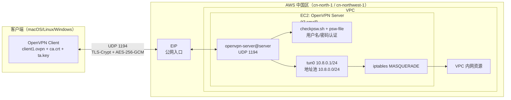

# 架构文档

## 目标

在 AWS 中国区（宁夏/北京）通过一个 CloudFormation 模板一键部署单实例 OpenVPN Server，验证用户名/密码认证的 Client VPN 能否让外部客户端安全接入并访问 VPC 内网资源。

## 组件

- **CloudFormation 模板** `openvpn-server.yaml`：一键创建 EC2、EIP、安全组等资源，约 4–5 分钟完成部署（`CreationPolicy` 等待 `cfn-signal`）
- **OpenVPN Server**：单台 EC2（默认 `t3.small`），监听 UDP 1194，绑定 EIP 提供公网入口
- **认证**：用户名/密码（`checkpsw.sh` 脚本 + `psw-file`，每次连接实时读取，无需重启服务即可加减用户）
- **加密**：AES-256-GCM + TLS 1.2+，TLS-Crypt 加固控制通道握手
- **网络**：`tun0` 虚拟网卡，VPN 地址池 `10.8.0.0/24`（客户端从 `10.8.0.2` 起分配），`iptables MASQUERADE` 把 VPN 客户端流量 NAT 到 VPC 内网
- **客户端配置**：`client1.ovpn` 模板，需要服务器下发的 `ca.crt`、`ta.key` 配合使用

## 架构图

客户端用 CloudFormation 部署完成后从服务器下载的 `ca.crt`、`ta.key`，结合改好 `remote` 地址的 `client1.ovpn` 发起连接；流量经 EIP 到达 EC2 上的 OpenVPN 进程，先由 TLS-Crypt 加固的控制通道完成 TLS 握手，再走 `checkpsw.sh` 校验用户名/密码。认证通过后客户端从 `10.8.0.0/24` 地址池分配到一个虚拟 IP，本地出现 `tun0`（或对应虚拟网卡），后续访问 VPC 内网资源的流量经隧道进入 EC2，由 `iptables MASQUERADE` 做源地址转换后转发进 VPC。

## 关键点

- **认证热更新**：新增/删除用户只需编辑 EC2 上的 `/etc/openvpn/psw-file`（`用户名 密码` 一行一个），无需重启 `openvpn-server@server` 服务
- **单实例、无高可用**：本仓库是单 EC2 部署，不含类似 `aws-china-strongswan-ha-vpn` 那样的 EIP 漂移或双节点容灾设计，适合演示和小规模接入，非生产高可用方案
- **中国区可用**：整个方案不依赖 Amazon Bedrock 等海外专属服务，可直接在 `cn-north-1`/`cn-northwest-1` 部署
- **资源清理**：`aws cloudformation delete-stack` 即可删除 EC2、EIP、安全组等全部资源，避免遗留计费
