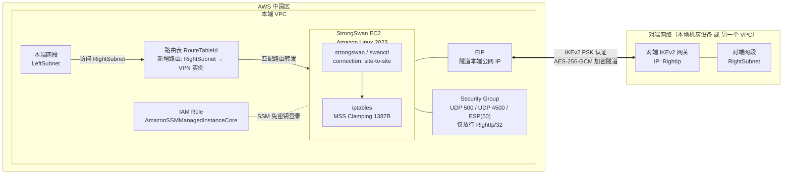

# 架构文档

## 目标

在 AWS 中国区通过一台运行 **StrongSwan** 的 EC2 实例，搭建 IKEv2 + AES-256-GCM 的站点到站点软件 IPSec VPN，验证本端 VPC 网段与对端网络（本地机房设备或另一个 VPC）之间可以建立加密隧道并互通业务流量，作为无法使用 AWS 托管 Site-to-Site VPN 场景下的替代方案。

## 拓扑

- 本端：AWS 中国区 VPC
  - `StrongSwan EC2`：Amazon Linux 2023，单节点，运行 `strongswan` / `swanctl`
  - `EIP`：CloudFormation 自动创建并绑定到 VPN 实例，作为隧道本端公网 IP
  - `Security Group`：仅放行来自对端公网 IP（`RightIp/32`）的 UDP 500（IKE）、UDP 4500（NAT-T）、协议号 50（ESP）
  - `IAM Role`：`AmazonSSMManagedInstanceCore`，支持 SSM Session Manager 免密钥对登录
  - `路由表（RouteTableId）`：自动追加一条 `RightSubnet → VPN 实例` 的路由，VPN 实例关闭了 `SourceDestCheck`，充当网关角色
  - `LeftSubnet`：本端参与互通的网段（VPC/子网 CIDR）
- 对端：两种场景均支持
  - 场景 1：本地机房支持 IKEv2 的设备（防火墙/路由器/另一台 StrongSwan）
  - 场景 2：AWS 中国区另一个 VPC 中的同款 StrongSwan EC2
  - `RightIp`：对端公网 IP；`RightSubnet`：对端网段

隧道认证方式为预共享密钥（PSK，CloudFormation 参数 `NoEcho`，最少 20 位）。IKE 提议为 `aes256-sha256-ecp256`，ESP 提议为 `aes256gcm128`（AEAD），IKE SA 生命周期默认 `86400s`，子 SA（Child SA）生命周期默认 `3600s`，均可通过模板参数调整。

## 架构图

## 流量路径

本端 `LeftSubnet` 内的主机访问对端 `RightSubnet` 内的 IP 时，流量先按 VPC 路由表命中新增的静态路由，转发到 StrongSwan EC2（该实例已关闭 `SourceDestCheck`，可作为网关转发非自身 IP 的流量）。实例上的 `swanctl` 按 `site-to-site` 连接配置，将报文按 `tunnel` 模式做 ESP 封装（`aes256gcm128`），经 UDP 4500（NAT-T）或 ESP（协议 50）发往对端公网 IP `RightIp`；对端解封装后转发到 `RightSubnet` 内的目标主机。回程流量按相同路径反向加密传输。为避免 IPSec 封装后报文超过 MTU 导致 TCP 卡死，实例通过 `iptables` 对经隧道转发的 TCP 报文做 MSS Clamping（`1387` 字节）。

## 关键技术点

- **协议栈升级**：从已 EOL 的 Openswan 迁移到 StrongSwan，使用 `swanctl`（而非旧版 `ipsec.conf`/`ipsec` 命令）管理连接，协议固定为 IKEv2，底座升级到 Amazon Linux 2023。
- **网关式转发**：VPN 实例需要转发非自身 IP 的流量，因此在 `AWS::EC2::Instance` 上关闭 `SourceDestCheck`，并在系统层开启 `net.ipv4.ip_forward = 1`，同时关闭 `rp_filter` 避免非对称路由被丢包。
- **安全组最小化放行**：仅放行来自 `RightIp/32` 的 UDP 500（IKE）、UDP 4500（IPSec NAT-T）、协议号 50（ESP），不开放其他入站端口。
- **PSK 管理**：预共享密钥通过 CloudFormation 参数传入并标记 `NoEcho`，最少 20 位随机字符，两端需保持一致。
- **免密钥对运维**：`KeypairName` 参数可留空，IAM Role 挂载 `AmazonSSMManagedInstanceCore` 托管策略，改用 SSM Session Manager 登录实例。
- **中国区适配**：IAM 信任策略使用 `ec2.amazonaws.com.cn` 服务主体、托管策略 ARN 使用 `arn:aws-cn:` 分区前缀，`UserData` 中额外配置了清华大学 EPEL 镜像源加速软件包安装，并将时区设置为 `Asia/Shanghai`。
- **MTU 处理**：ESP 隧道模式封装会增加报文开销，通过 `iptables -t mangle` 对经隧道转发的 TCP SYN 报文做 MSS Clamping（1387 字节），避免 Path MTU 问题导致的 TCP 连接卡死。
- **单节点、无内置高可用**：本方案为单 EC2 节点，VPN 实例故障即中断隧道；如需主备双节点 + EIP 自动漂移的高可用方案，参见姊妹项目 [`aws-china-strongswan-ha-vpn`](https://github.com/toreydai/aws-china-strongswan-ha-vpn)。
- **同 Region 同账号场景的替代选择**：若两个 VPC 处于同一账号同一 Region，README 建议优先使用免费、低延迟、无带宽限制的 VPC Peering；需要跨账号或更大规模互联时再考虑 Transit Gateway，软件 IPSec VPN 更适合需要自定义加密参数或跨 Region/跨云互通的场景。
