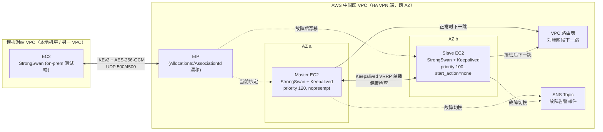
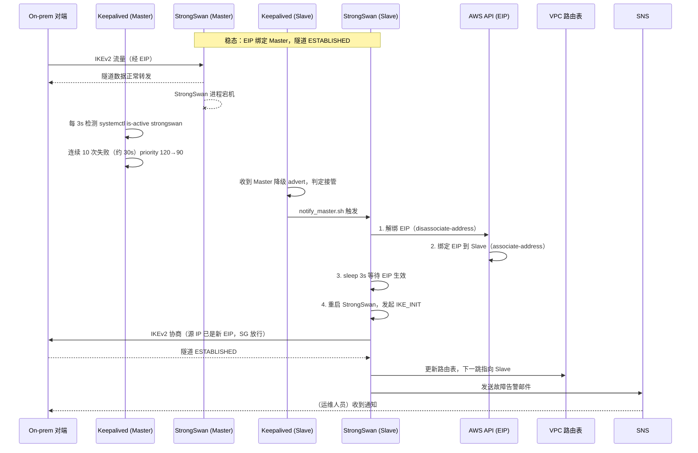

# 架构文档

## 目标

在 AWS 中国区验证一套基于 StrongSwan + Keepalived 的站点到站点高可用 IPSec VPN：主节点故障时 EIP 能自动漂移到备节点、隧道自动重建，且故障期间通过 SNS 发送告警邮件，全程无需人工干预即可恢复连通性。

## 组件

- **HA VPN 端 VPC**（`strongswan-main-china-new-vpc.yaml`，跨 AZ 部署）
  - Master EC2：StrongSwan（IKEv2 + AES-256-GCM）+ Keepalived（`state BACKUP`，priority 120，`nopreempt`，`start_action=start`）
  - Slave EC2：StrongSwan（守护进程常驻但 `start_action=none`，不主动发起隧道）+ Keepalived（priority 100）
  - 单个 EIP，通过 AllocationId/AssociationId 方式在 Master/Slave 间漂移
  - SNS Topic：故障切换告警邮件
- **模拟对端 VPC**（`strongswan-on-prem-test-new-vpc.yaml`，用于无真实本地机房时模拟本地端）
- 底座：Amazon Linux 2023（原 Openswan 方案已停止维护，本仓库升级为 StrongSwan）
- 两个 CloudFormation 模板互相通过 `RemoteServerIP`/`RemoteSubnet` 参数指向对方的公网 IP 和网段

## 架构图

正常状态下 EIP 绑定在 Master 上，对端只允许来自该 EIP 的 UDP 500/4500 流量，IKEv2 隧道由 Master 主动发起并维持；Slave 的 StrongSwan 守护进程保持运行但不主动发起连接（`start_action=none`），只靠 Keepalived 健康检查探活。Keepalived 用单播 VRRP（不依赖组播，适配 AWS VPC 网络模型）在 Master/Slave 间交换优先级，一旦 Master 的 StrongSwan 进程被判定为不健康，Slave 会先把 EIP 漂移到自己名下，再重启 StrongSwan 发起隧道协商，最后更新 VPC 路由表把对端流量切到自己，全过程通过 SNS 通知运维人员。

## 请求路径图

## IPSec 隧道协商与 EIP 漂移机制

- **加密套件**：IKE 用 `aes256-sha256-ecp256`（AES-256 + SHA-256 + ECP-256/ECDH），ESP 用 `aes256gcm128`（AEAD，无需单独认证算法）；IKE 生命周期 24h，SA 生命周期 1h
- **EIP 漂移必须先于隧道重建**：对端安全组只放行来自 VPN EIP 的 UDP 500/4500，若 StrongSwan 先于 EIP 迁移启动，Slave 发出的 IKE_INIT 源 IP 还是自己原有公网 IP，会被对端 SG 拒绝并在 5 次重传后放弃；因此 `notify_master.sh` 严格按"迁移 EIP → sleep 3s → 重启 StrongSwan”的顺序执行
- **Slave StrongSwan 为何保持运行而不停止**：Keepalived 用 `weight -30` 的健康检查脚本决定优先级，若 Slave 的 StrongSwan 也被停止，其 priority 会降到 70，低于 Master 故障后的 90，导致 Master 仍赢得选举、故障切换永远不会触发；因此 Slave 的 StrongSwan 常驻但 `start_action=none`，不主动发起连接，靠对端 SG 天然阻断意外连接
- **`nopreempt` 避免脑裂式抖动**：Master/Slave 均配置为 `state BACKUP`，Master 用更高 priority 并加 `nopreempt`，故障恢复后不会自动抢占，需运维人员确认 Master 完全健康后手动执行 failback，避免网络抖动导致 EIP 来回漂移
- **实测数据**（cn-northwest-1）：故障检测约 30s（10 × 3s），Failover 总耗时约 3 分钟，Failback 总耗时约 2.5 分钟，切换前后隧道延迟均 < 1ms
